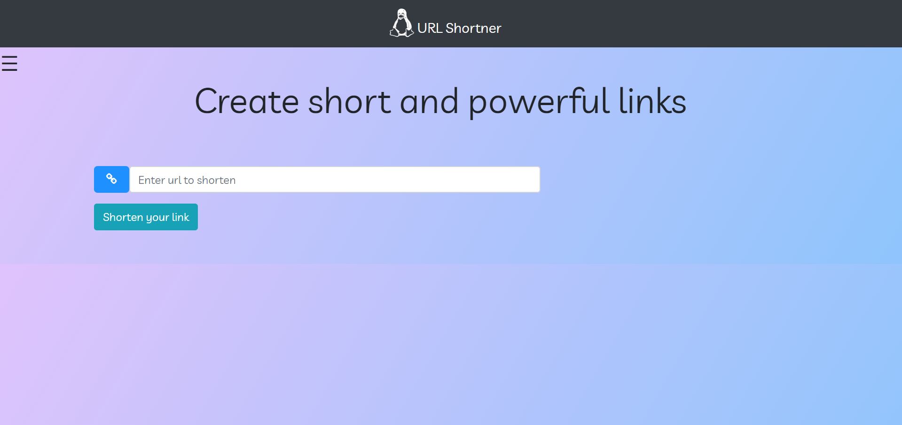

# URL Shortner using NodeJS/ MongoDB

Create short and powerful links

The project creates short, powerful and secure links of any link provided.

# Usage

1.  Install NodeJS on your device to run this project.
2.  Clone the repository at https://github.com/Cshayan/URL-Shortner-using-Node-and-MongoDB.git
3.  Install the dependencies by running npm install in project folder.
4.  Install nodemon by typing npm i -D nodemon.
5.  Finally to run the project type nodemon.

The server will start running on port 5000. Open your browser and type http://localhost:5000 to view the working of
the project.
